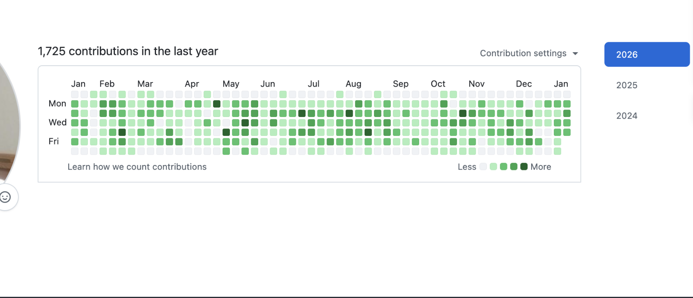

# Hey, I'm Piyush Jain 👋

**Software Development Engineer (Backend) @ Traveloka · IIT Dharwad '24**

---

## 🚀 About Me

- 🏗️ Currently building **backend systems** at **Traveloka**
- ⚡ I build **high-performance microservices** with expertise in **Java, Go, and AWS**
- 🧠 Passionate about **system design**, **search infrastructure**, and **Generative AI**

---

## 🛠️ Tech Stack

---

## 👨‍💻 Work GitHub Activity

> 💼 Most of my daily coding happens on my **company GitHub account**.

 

*Contribution graph from Traveloka (Dec 2024 - Present)*

---

## 🚢 What I've Shipped (at work)

While I can't share code, here's what I've built:

| | Project | Impact |
|---|---|---|
| 🤖 | **LLM-based Route Translation Service** | 4% increase in flight search CTR |
| 🔍 | **Nexus Service** (Elasticsearch middleware) | 3x latency reduction (160ms → 57ms), scaled to 38k RPM |
| 🌏 | **AWS OpenSearch** (Korean/Chinese support) | 7% RPM increase for market expansion |
| ⚙️ | **Generic Compilation Service** | 30% dev time reduction, processing 1TB/hour |
| 📦 | **Anakin Commons Library** | 30% dev time reduction, 10% fewer human errors |
| 📊 | **Scalable Data Extraction Pipelines** | 200k+ products extracted from top e-commerce platforms |

---

## 🤝 Let's Connect

[LinkedIn](https://www.linkedin.com/in/piyush-jain5703) • [Email](mailto:piyushjain5703@gmail.com)

